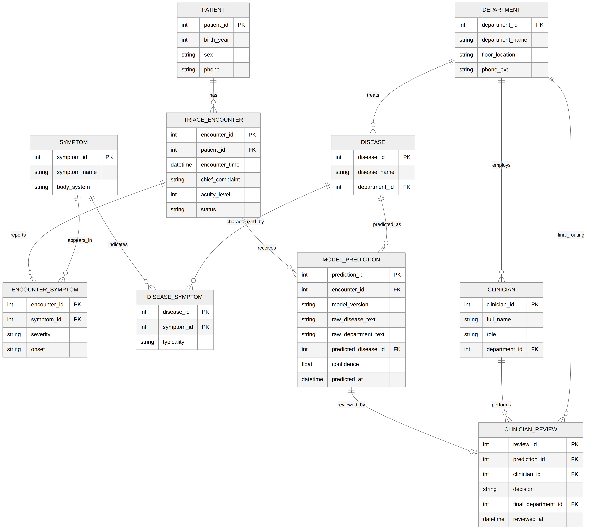

# Database Schema for Clinical Triage System

This is the backend database designed to support the fine-tuned model in
[`01_sft_lora/`](../01_sft_lora) and [`02_dpo/`](../02_dpo). The model predicts
a disease and department from a patient's reported symptoms; this schema
gives those predictions somewhere to live — linked to real patients,
encounters, and clinician review (human-in-the-loop).

## Why this exists

A fine-tuned model that predicts `disease` and `department` from symptoms is
only half of a working triage system. It has no memory of which patient it
was talking to, no link back to the encounter that produced the input, and
no way to record whether a clinician agreed with it. This schema is the
piece that turns a standalone model into something that could actually run
in a clinic: every prediction is tied to a real encounter, and every
clinician decision is tied to a real prediction — so nothing the model or
the clinician does gets lost or silently overwritten.

## Files

| File | Contents |
|---|---|
| `schema.sql` | `CREATE TABLE` statements for all 10 tables |
| `sample_data.sql` | `INSERT` statements populating each table |
| `hospital_queries.sql` | 5 example queries built around real hospital scenarios |
| `erd_diagram.png` | Entity-relationship diagram (hand-built in Mermaid) |

## Schema overview

10 tables, normalized to 3NF:

- **PATIENT, DEPARTMENT, CLINICIAN, DISEASE, SYMPTOM** — reference data
- **TRIAGE_ENCOUNTER** — one row per patient visit
- **ENCOUNTER_SYMPTOM, DISEASE_SYMPTOM** — associative tables resolving the
  many-to-many relationships between encounters/diseases and symptoms
- **MODEL_PREDICTION** — what the model said (raw output + resolved disease id + confidence)
- **CLINICIAN_REVIEW** — what the clinician decided (accept or override), stored
  *separately* from the prediction so disagreements are never lost



## Design highlight: predictions and reviews are never merged

`MODEL_PREDICTION` and `CLINICIAN_REVIEW` are deliberately two separate
tables rather than one. If a clinician overrides the model's suggested
department, the original prediction is preserved untouched — only a new
review row is added with the clinician's final decision. That is what makes
several of the queries below possible: you can't measure how often a model
is overridden if the override already erased what the model originally said.

`MODEL_PREDICTION` also keeps `raw_disease_text` and `raw_department_text` —
the model's literal output — alongside the resolved `predicted_disease_id`
foreign key, so the model's exact wording is never lost even after it's
been matched back to a clean `DISEASE` row.

## Example queries (in `hospital_queries.sql`)

Five queries built around real hospital scenarios:

1. **Triage sorting** — which unresolved encounters to see next, most urgent first
2. **Review queue** — predictions still awaiting a clinician's sign-off (`LEFT JOIN ... IS NULL`)
3. **Override analysis** — every case where a clinician overrode the model, and where the patient was actually routed
4. **Model confidence** — average / min / max confidence across all predictions
5. **Trust calibration** — average confidence of overridden vs. confirmed predictions


## Running it

```bash
sqlite3 clinical_triage.db < schema.sql
sqlite3 clinical_triage.db < sample_data.sql
sqlite3 clinical_triage.db < hospital_queries.sql

sqlite3 clinical_triage.db
sqlite> .headers on
sqlite> .mode column
sqlite> SELECT * FROM DEPARTMENT;
```
